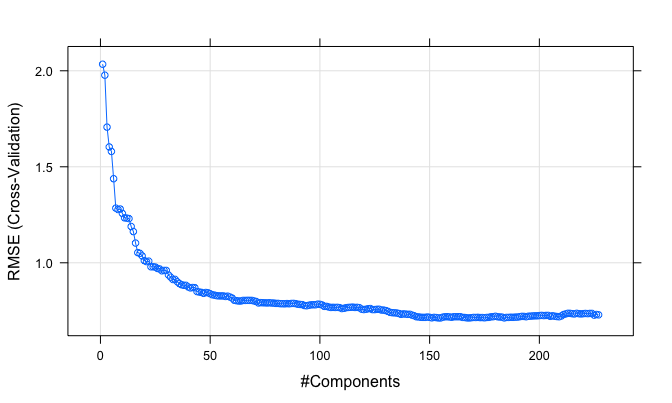

P8106\_hw1\_xh2395
================
Xin He
2/29/2020

## Homework 1 Description

In this exercise, we will predict solubility of compounds using their
chemical structures. The training data are in the file
“solubility\_train.csv” and the test data are in the file
“solubility\_test.csv”. Among the 228 predictors, 208 are binary
variables that indicate the presence or absence of a particular chemical
substructure, 16 are count features, such as the number of bonds or the
number of bromine atoms, and 4 are continuous features, such as
molecular weight or surface area. The response is in the column
“Solubility” (the last column).

## Import the data

``` r
# Import the train data
train = read_csv("./data/solubility_train.csv")
# Import the test data
test = read_csv("./data/solubility_test.csv")
```

## Set random seed

``` r
set.seed(2020)
```

## Answer of the questions

#### a.Fit a linear model using least squares on the training data and calculate the mean square error using the test data

##### (1) Fit a linear model using least squares on the training data

``` r
train_X = model.matrix(Solubility~.,train)[,-1]
train_Y = train$Solubility
train_control = trainControl(method = "cv",number = 10)
lm_fit = train(
    x = train_X,
    y = train_Y, 
    method = 'lm',
    trControl = train_control,
    metric = 'RMSE'
)

# summary(lm_fit)
# There are too many predicators so I do not show the result
```

##### (2) Calculate the mean square error using the test data

``` r
train_mse = mean(lm_fit$residuals^2)
train_mse
```

    ## [1] NaN

``` r
test_mse = mean((test$Solubility - predict(lm_fit, test)) ^ 2)
test_mse
```

    ## [1] 0.5558898

The mean square error using the test data is
0.5558898.

#### b. Fit a ridge regression model on the training data, with lambda chosen by cross-validation. Report the test error.

##### (1) Fit a ridge regression model on the training data, with lambda chosen by cross-validation

``` r
train_X = model.matrix(Solubility~.,train)[,-1]
train_Y = train$Solubility
train_control = trainControl(method = "cv",number = 10)
ridge_fit = train(
    x = train_X,
    y = train_Y, 
    method = 'glmnet',
    tuneGrid = expand.grid(alpha = 0,lambda = exp(seq(-8, 10, length = 100))),
    trControl = train_control,
    metric = 'RMSE'
)
```

``` r
ridge_fit$bestTune
```

    ##    alpha    lambda
    ## 33     0 0.1128362

``` r
plot(ridge_fit, xTrans = function(x)log(x))
```


``` r
# coef(ridge_fit$finalModel, ridge_fit$bestTune$lambda)
# No variable is dropped from the ridge model, however parameters all become smaller.
```

##### (2) Report the test error

``` r
test_X = model.matrix(Solubility~.,test)[,-1]
test_Y = test$Solubility
ridge_predict_Y = predict.train(ridge_fit, test_X)
ridge_test_mse = mean((test_Y - ridge_predict_Y)^2)

ridge_test_mse
```

    ## [1] 0.5134603

The chosen \(lambda\) is 0.1128362. The mean square error using the test
data is
0.5134603.

#### c. Fit a lasso regression model on the training data, with lambda chosen by cross-validation. Report the test error, along with the number of non-zero coefficient estimates.

##### (1) Fit a lasso regression model on the training data, with lambda chosen by cross-validation

``` r
lasso_fit = train(
    x = train_X,
    y = train_Y, 
    method = 'glmnet',
    tuneGrid = expand.grid(alpha = 1,lambda = exp(seq(-8, 10, length = 100))),
    trControl = train_control
)
```

``` r
lasso_fit$bestTune
```

    ##    alpha     lambda
    ## 15     1 0.00427682

``` r
plot(lasso_fit, xTrans = function(x)log(x))
```


##### (2) Report the test error, along with the number of non-zero coefficient estimates

``` r
lasso_predict_Y = predict.train(lasso_fit, test_X)
lasso_test_mse = mean((test_Y - lasso_predict_Y)^2)

lasso_test_mse
```

    ## [1] 0.5005751

``` r
coef(lasso_fit$finalModel, lasso_fit$bestTune$lambda) 
```

    ## 229 x 1 sparse Matrix of class "dgCMatrix"
    ##                               1
    ## (Intercept)        7.2124210666
    ## FP001              .           
    ## FP002              0.2519840764
    ## FP003             -0.0494656816
    ## FP004             -0.2407247052
    ## FP005              .           
    ## FP006             -0.0614159318
    ## FP007              .           
    ## FP008              .           
    ## FP009              .           
    ## FP010              .           
    ## FP011              .           
    ## FP012             -0.0500023384
    ## FP013             -0.0611853244
    ## FP014              .           
    ## FP015             -0.0973670918
    ## FP016             -0.0709900672
    ## FP017             -0.1500824454
    ## FP018             -0.1001029287
    ## FP019              .           
    ## FP020              0.1113026573
    ## FP021              .           
    ## FP022              .           
    ## FP023             -0.1641031520
    ## FP024             -0.1206609006
    ## FP025              .           
    ## FP026              0.2638172724
    ## FP027              0.2999083981
    ## FP028              0.0005528193
    ## FP029              .           
    ## FP030             -0.1605339664
    ## FP031              0.1214885615
    ## FP032              .           
    ## FP033              0.1214692062
    ## FP034             -0.0205163607
    ## FP035             -0.1492497069
    ## FP036              .           
    ## FP037              0.2130071963
    ## FP038              0.0773608447
    ## FP039             -0.4225608829
    ## FP040              0.4420974366
    ## FP041              .           
    ## FP042              .           
    ## FP043              0.0597526566
    ## FP044             -0.2904652560
    ## FP045              0.0953931733
    ## FP046              .           
    ## FP047              .           
    ## FP048              .           
    ## FP049              0.2946386692
    ## FP050             -0.1595275524
    ## FP051              .           
    ## FP052             -0.0003774617
    ## FP053              0.2445026929
    ## FP054             -0.0845035269
    ## FP055             -0.1577185670
    ## FP056              .           
    ## FP057             -0.0909739276
    ## FP058              .           
    ## FP059             -0.2930898637
    ## FP060              .           
    ## FP061             -0.1676148422
    ## FP062              .           
    ## FP063              0.1012443885
    ## FP064              0.2466629335
    ## FP065             -0.1426130807
    ## FP066              0.0506211109
    ## FP067              .           
    ## FP068              0.0090832520
    ## FP069              0.1320654609
    ## FP070             -0.0857263737
    ## FP071              0.1023759105
    ## FP072              .           
    ## FP073             -0.1344282242
    ## FP074              0.1054442431
    ## FP075              0.1861528905
    ## FP076              0.1797337989
    ## FP077              0.0838039845
    ## FP078             -0.1518658151
    ## FP079              0.2024091425
    ## FP080              0.0002096148
    ## FP081             -0.1995772731
    ## FP082              0.1394762822
    ## FP083             -0.3572442847
    ## FP084              0.2457973950
    ## FP085             -0.3287426218
    ## FP086             -0.0112778582
    ## FP087              .           
    ## FP088              0.0978898262
    ## FP089              .           
    ## FP090             -0.0028125738
    ## FP091              0.0060864612
    ## FP092              .           
    ## FP093              0.1556942981
    ## FP094             -0.1710746564
    ## FP095              .           
    ## FP096             -0.0579737261
    ## FP097              .           
    ## FP098             -0.0496965796
    ## FP099              0.1729580108
    ## FP100              .           
    ## FP101              .           
    ## FP102              .           
    ## FP103             -0.1175757908
    ## FP104             -0.0877062845
    ## FP105             -0.0597741690
    ## FP106              0.0735528025
    ## FP107              .           
    ## FP108              .           
    ## FP109              0.3383025102
    ## FP110              .           
    ## FP111             -0.3583974683
    ## FP112             -0.0014880067
    ## FP113              0.1125583167
    ## FP114              .           
    ## FP115              .           
    ## FP116              0.0402046981
    ## FP117              .           
    ## FP118             -0.1027299387
    ## FP119              0.2398243604
    ## FP120             -0.0155668779
    ## FP121              .           
    ## FP122              0.2050296161
    ## FP123              .           
    ## FP124              0.2944391294
    ## FP125              0.0509317833
    ## FP126             -0.1652919222
    ## FP127             -0.5030883835
    ## FP128             -0.2328044104
    ## FP129              .           
    ## FP130             -0.3055030731
    ## FP131              0.2008191272
    ## FP132             -0.0355446202
    ## FP133             -0.1591928307
    ## FP134              .           
    ## FP135              0.1830330456
    ## FP136              .           
    ## FP137              0.1815118726
    ## FP138              0.2391670797
    ## FP139              .           
    ## FP140              0.0409288655
    ## FP141             -0.0850757757
    ## FP142              0.4503379707
    ## FP143              0.3400866573
    ## FP144              .           
    ## FP145             -0.0700662593
    ## FP146              .           
    ## FP147              0.1489000346
    ## FP148             -0.0482926502
    ## FP149              .           
    ## FP150              0.0264793025
    ## FP151              .           
    ## FP152              .           
    ## FP153              .           
    ## FP154             -0.5176847462
    ## FP155              0.0338865936
    ## FP156             -0.2249731170
    ## FP157             -0.0688022630
    ## FP158              .           
    ## FP159              0.0728766859
    ## FP160             -0.0512307031
    ## FP161             -0.0749409159
    ## FP162              .           
    ## FP163              0.1819338776
    ## FP164              0.3982416794
    ## FP165              .           
    ## FP166              0.0241236125
    ## FP167             -0.0982916211
    ## FP168              .           
    ## FP169             -0.1506311066
    ## FP170              0.0125291046
    ## FP171              0.2558153474
    ## FP172             -0.5356829119
    ## FP173              0.3539732362
    ## FP174             -0.1101425214
    ## FP175              .           
    ## FP176              0.4112495389
    ## FP177              .           
    ## FP178              .           
    ## FP179              .           
    ## FP180             -0.0833540086
    ## FP181              0.1954261965
    ## FP182             -0.0332594103
    ## FP183              .           
    ## FP184              0.3159816999
    ## FP185              .           
    ## FP186             -0.2190469996
    ## FP187              0.2133425614
    ## FP188              0.2030228231
    ## FP189              .           
    ## FP190              0.2738577672
    ## FP191              0.0882876692
    ## FP192              0.0756396645
    ## FP193              .           
    ## FP194              .           
    ## FP195              .           
    ## FP196              .           
    ## FP197             -0.0001305160
    ## FP198              0.1664709287
    ## FP199              .           
    ## FP200              .           
    ## FP201             -0.3004319389
    ## FP202              0.4161921588
    ## FP203              0.0747368145
    ## FP204              .           
    ## FP205              .           
    ## FP206             -0.0483380504
    ## FP207              .           
    ## FP208              .           
    ## MolWeight         -1.3308661301
    ## NumAtoms           .           
    ## NumNonHAtoms       .           
    ## NumBonds           .           
    ## NumNonHBonds      -0.9650563972
    ## NumMultBonds      -0.1329744596
    ## NumRotBonds       -0.2430571472
    ## NumDblBonds        .           
    ## NumAromaticBonds  -0.1113188287
    ## NumHydrogen        0.1131404040
    ## NumCarbon         -0.6493971972
    ## NumNitrogen        0.2082905631
    ## NumOxygen          0.5295073750
    ## NumSulfer         -0.2679339933
    ## NumChlorine       -0.5584819923
    ## NumHalogen         .           
    ## NumRings          -0.0316872851
    ## HydrophilicFactor  .           
    ## SurfaceArea1       0.2493562269
    ## SurfaceArea2       .

The chosen \(lambda\) is 0.00427682. The mean square error using the
test data is 0.5005751. The number of non-zero coefficient estimates
(exclude intercept) is
147.

#### d. Fit a principle component regression model on the training data, with M chosen by cross-validation. Report the test error, along with the value of M selected by cross-validation.

##### (1) Fit a pcr model on the training data, with M chosen by cross-validation

``` r
train_X = model.matrix(Solubility~.,train)[,-1]
train_Y = train$Solubility
train_control = trainControl(method = "cv",number = 10)
pcr_fit = train(
    x = train_X,
    y = train_Y, 
    method = 'pcr',
    tuneLength = length(train) - 1,
    trControl = train_control,
    scale = TRUE
)
```

``` r
plot(pcr_fit)
```



##### (2) Report the test error, along with the value of M selected by cross-validation

``` r
pcr_predict_Y = predict.train(pcr_fit, test_X)
pcr_test_mse = mean((test_Y - pcr_predict_Y)^2)

pcr_test_mse
```

    ## [1] 0.5497181

``` r
pcr_fit$bestTune
```

    ##     ncomp
    ## 155   155

The value of M selected by cross-validation is 155. The mean square
error using the test data is 0.5497181.

#### e. Briefly discuss the results obtained in a~d

``` r
mse_table = tibble(
    metric = 'Test MSE',
    linear_model =  0.5558898,
    ridege = 0.5134603,
    lasso = 0.5005751,
    pcr = 0.5497181
)
mse_table %>% knitr::kable(digits = 4)
```

| metric   | linear\_model | ridege |  lasso |    pcr |
| :------- | ------------: | -----: | -----: | -----: |
| Test MSE |        0.5559 | 0.5135 | 0.5006 | 0.5497 |

``` r
resamp = resamples(list(lm = lm_fit,
                        ridge = ridge_fit,
                        lasso = lasso_fit,
                        pcr = pcr_fit))

summary(resamp)
```

    ## 
    ## Call:
    ## summary.resamples(object = resamp)
    ## 
    ## Models: lm, ridge, lasso, pcr 
    ## Number of resamples: 10 
    ## 
    ## MAE 
    ##            Min.   1st Qu.    Median      Mean   3rd Qu.      Max. NA's
    ## lm    0.4385548 0.4812080 0.5152432 0.5294767 0.5666982 0.6346940    0
    ## ridge 0.4712691 0.4855278 0.5381310 0.5301129 0.5572804 0.6096479    0
    ## lasso 0.4220311 0.4952259 0.5128497 0.5179702 0.5337301 0.6392239    0
    ## pcr   0.4729687 0.5164995 0.5380665 0.5458627 0.5942422 0.6129644    0
    ## 
    ## RMSE 
    ##            Min.   1st Qu.    Median      Mean   3rd Qu.      Max. NA's
    ## lm    0.5912314 0.6515463 0.7083357 0.7093170 0.7451264 0.8395163    0
    ## ridge 0.6144623 0.6281570 0.6971238 0.6931890 0.7114787 0.8201911    0
    ## lasso 0.5350592 0.6305500 0.6504601 0.6733829 0.6941750 0.8878028    0
    ## pcr   0.6338821 0.6551096 0.7073545 0.7127073 0.7625219 0.8175443    0
    ## 
    ## Rsquared 
    ##            Min.   1st Qu.    Median      Mean   3rd Qu.      Max. NA's
    ## lm    0.8386010 0.8703807 0.8844563 0.8838276 0.8945696 0.9191420    0
    ## ridge 0.8443171 0.8749501 0.8866810 0.8847726 0.8968318 0.9228943    0
    ## lasso 0.8511736 0.8886037 0.8920666 0.8925266 0.9060291 0.9245806    0
    ## pcr   0.8545305 0.8753421 0.8842295 0.8813528 0.8864531 0.9029438    0

``` r
bwplot(resamp, metric = "RMSE")
```


By comparing the test mean square errors, we can see that the linear
regression model performs worst and the principle component regression
model also performs badly in the test data. The lasso model performs
best. The ridge model performs better than the principle component
regression model, but worse than the lasso model.

Linear Regression Model: It keeps all variables without any constrain in
the model and when some variables are corrlated there is a high variance
problem.

Principal Componet Regression: Use a small number of linear combinations
of the original inputs.

Ridge Model: Shrink and keep all variables .

Lasso Model: Shrink some variables to 0.(Can be used to do features
selection)

#### f. Which model will you choose for predicting solubility?

I will choose the lasso model which performs best for predicting
solubility.
